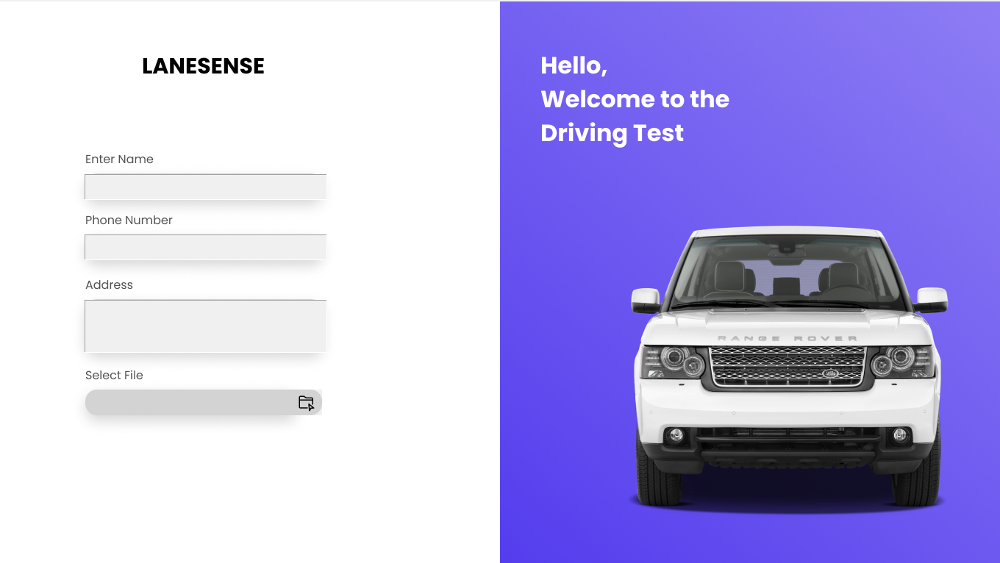
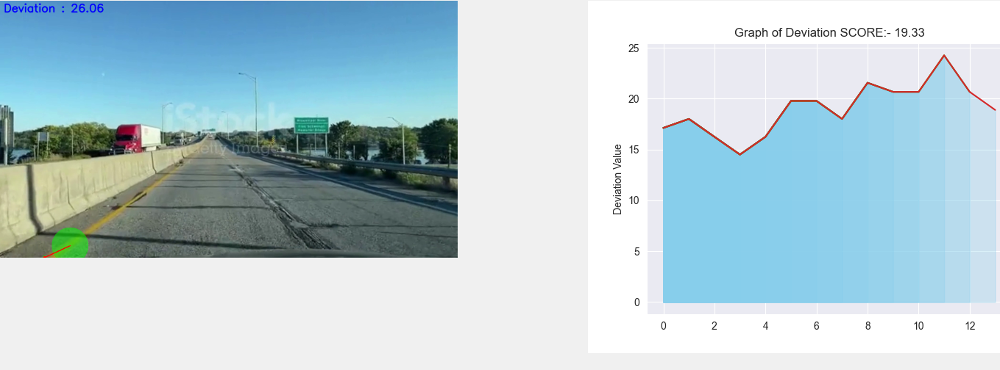
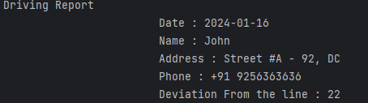

# LaneSense

<h1 align="centre">
   
</h1>


# Table of Contents
- [Introduction](#introduction) <br>
- [Requirements](#requirements) <br>
- [How to use](#how-to-use) <br>
- [Working](#working)

# Introduction
-	Many technical improvements have recently been made in the field of road safety,
as accidents have been increasing at an alarming rate, and one of the major causes
of such accidents is a driver's lack of attention. To lower the incidence of accidents
and keep safe, technological breakthroughs should be made. One method is to use
Lane Detection Systems, which function by recognizing lane borders on the road
and alerting the driver if he switches to an incorrect lane marking. A lane detection
system is an important part of many technologically advanced transportation
systems. Although it is a difficult goal to fulfil because to the varying road
conditions that a person encounters, particularly while driving at night or in
daytime. A camera positioned on the front of the car catches the view of the road
and detects lane boundaries. The method utilized in this research divides the video
image into a series of sub-images and generates image-features for each of them,
which are then used to recognize the lanes on the road.


# Requirements
For running the code, make sure that the following are installed on your local device.
|Requirements|
|--|
| [Python 3.11.x](https://www.python.org/) |
| [OpenCV](https://opencv.org/) |
| Tkinter|
| NumPy|
| Matplotlib|
| Seaborn|

# How to use
1. Clone this repo. <br>
-  ```terminal
   git clone https://github.com/sanjanamareddy/LaneSense-A-Lane-Tracking-System-main
   ```

2. Install the required libraries from [Requirements](#requirements) <br>
3. Run LaneSense.py <br>
   
# Working
**1. Fill the Required Details and select the video footage**
<h1 align="centre">
   
</h1>

**2. Real-Time Tracking of Lane**

<h1 align="centre">
   
</h1>

**3. Results**

<h1 align="centre">
   
</h1>
